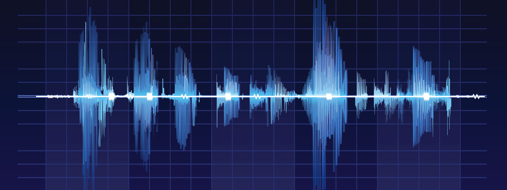

<!-- PROJECT LOGO -->
 

  

 
 

<!-- BACKGROUND & TITLE -->

  
  <h3 align="center">Circuits & Signals: Biomedical Applications</h3>
 

<!-- TABLE OF CONTENTS -->
## Table of Contents

* [**Notes**](https://github.com/MDBrodskiy/Circuits_Signals/tree/master/Notes/)
    * [**Introduction to Circuits & Signals**](https://github.com/MDBrodskiy/Circuits_Signals/tree/master/Notes/Section1.pdf)
    * [**Circuit Laws**](https://github.com/MDBrodskiy/Circuits_Signals/tree/master/Notes/Section2.pdf)
    * [**Node Voltage Method**](https://github.com/MDBrodskiy/Circuits_Signals/tree/master/Notes/Section3.pdf)
    * [**Mesh Current Method**](https://github.com/MDBrodskiy/Circuits_Signals/tree/master/Notes/Section4.pdf)
    * [**Thevnin and Norton Equivalents**](https://github.com/MDBrodskiy/Circuits_Signals/tree/master/Notes/Section5.pdf)
    * [**Operational Amplifiers**](https://github.com/MDBrodskiy/Circuits_Signals/tree/master/Notes/Section6.pdf)
* [**Lab Reports**](https://github.com/MDBrodskiy/Circuits_Signals/tree/master/Lab%20Reports/)
    * [**Lab One**](https://github.com/MDBrodskiy/Circuits_Signals/tree/master/Lab%20Reports/Lab1.pdf)
    * [**Lab Two**](https://github.com/MDBrodskiy/Circuits_Signals/tree/master/Lab%20Reports/Lab2.pdf)
    * [**Lab Three**](https://github.com/MDBrodskiy/Circuits_Signals/tree/master/Lab%20Reports/Lab3.pdf)
    * [**Lab Four**](https://github.com/MDBrodskiy/Circuits_Signals/tree/master/Lab%20Reports/Lab4.pdf)

<!--
  * [**Chapter 1**](#Notes/Chapter\ 1)
* [**Exams**](#Exams)
* [**Projects**](#Projects)
-->

An assortment of lecture notes and exams from Northeastern University's EECE2150 (Spring 2023)
    
Open sourced **LaTeX** Templates [here](https://www.latextemplates.com/).
 
**TikZ** diagram editor [here](https://www.mathcha.io/editor).
 
**TikZ** examples [here](https://www.texample.net/tikz/example).
 
**LaTeX** draw [here](https://www.latexdraw.com/).
     
Authentication:   
    <pre>to receive commit access to this repository e-mail Michael@Brodskiy.com for credential verification/authorization</pre>

Cloning This Repository
 &nbsp;&nbsp;with **command line interface**:
    <pre>    
    **$** git clone https://github.com/MDBrodskiy/Circuits_Signals.git    
    **$** **>**  **_**
    </pre>
